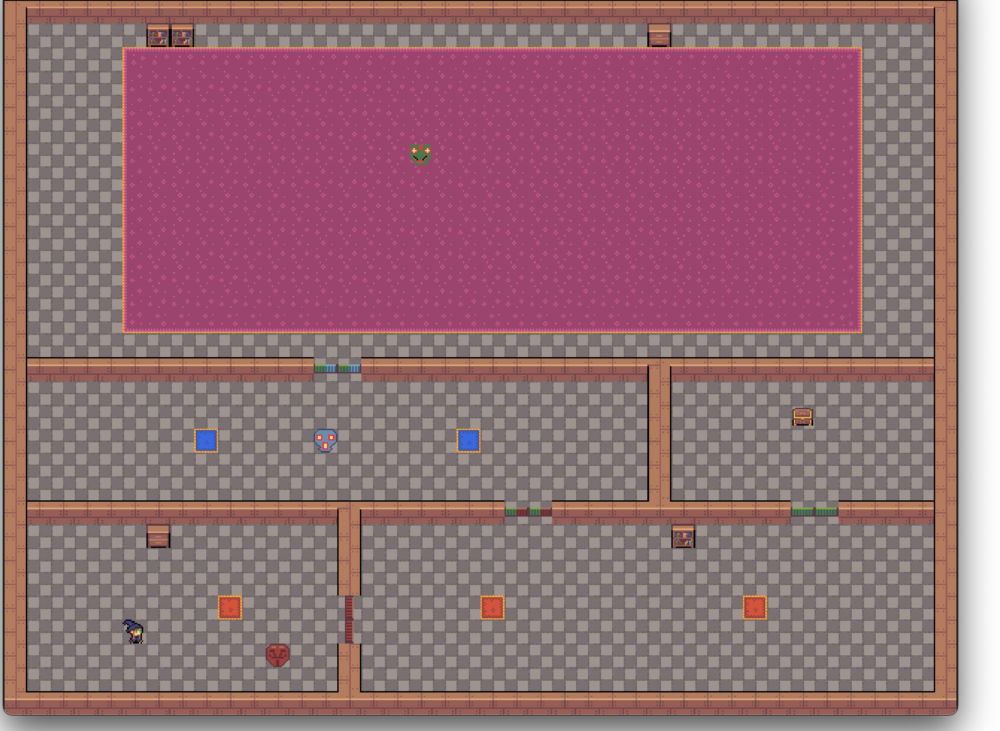

# MaskOS - A puzzle game implemented as an UEFI bootloader



## Description

MaskOS a puzzle game where you have to pick up masks, which let you walk through
colored doors. It was created from scratch over a weekend using Masquerade-Themed [Hasi GameJam
2022](https://wiki.hasi.it/GameJam). There are only three levels implemented;
We did run out of time at the end.

## Technology
 
MaskOS is built using no_std Rust and the 
[uefi crate](https://github.com/rust-osdev/uefi-rs).

## Running MaskOS

MaskOS runs on x64 Hardware that supports UEFI. We used
[qemu](https://www.qemu.org) for development.

Build the binary using:
```shell
cargo build --target x86_64-unknown-uefi --release
```

Create a bootable disk image by running:
```shell
./create_image.sh # only works on MacOs
```

